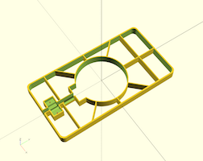
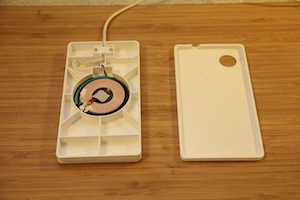
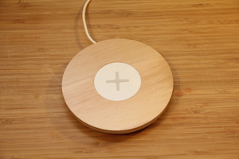
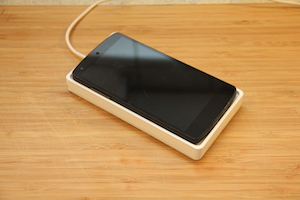

# Wireless IKEA charger mod for Nexus 5 (SCAD)

Make a simpler platform for charging the Nexus One with Wireless charging. Modding the IKEA NORDMÄRKE charger. Made with OpenSCAD.

Can also be found at [Thingiverse](http://www.thingiverse.com/thing:1703165) or [Youmagine](https://www.youmagine.com/designs/ikea-charger-mod-for-nexus-one).

License: [Creative Commons - Attribution - Non Commercial - Share Alike](https://creativecommons.org/licenses/by-nc-sa/4.0/)
